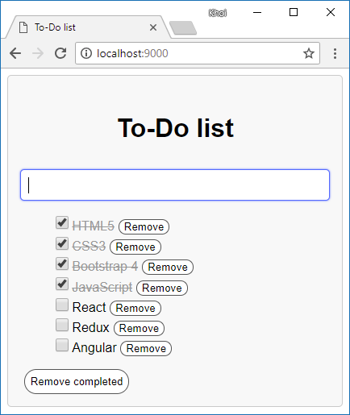

# Redux-TypeScript - Simple To-Do list
The simple Redux-TypeScript web application. ([View online demo](https://nguyenkhois.github.io/redux-ts-simple-todo-list/dist/))

## Screenshot

## Compatibility
Build environment is compatible with:
* Windows
* MacOS
* Debian

Webpack Dev Server reload automatically your web browser whenever a change is made to one of your files.

## Installation
* Run `npm install` to install all needed packages

## Using
* Run `npm start` or `npm run start` to start your local web server at `localhost:9000`
* Run `npm run build` to build your *.js files to `dist` folder
* Run `npm run build:all` to build all your files (*.js and styles.css) with `--mode production` to `dist` folder

## References
* [Migrating from JavaScript](https://www.typescriptlang.org/docs/handbook/migrating-from-javascript.html)
* [Leveling Up with React: Redux](https://css-tricks.com/learning-react-redux/)
* [Non-mutating methods](https://developer.mozilla.org/en-US/docs/Web/JavaScript/Reference/Global_Objects/Array/prototype#Accessor_methods)